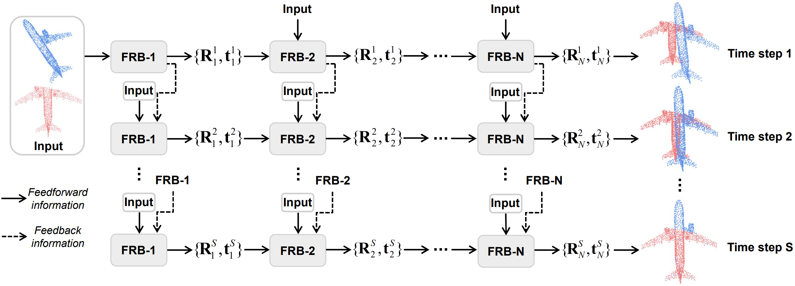

# Iterative Feedback Network for Unsupervised Point Cloud Registration (RAL 2024)
PyTorch implementation of the paper:
[Iterative Feedback Network for Unsupervised Point Cloud Registration](https://arxiv.org/abs/2401.04357).



## Environment
Our model is trained with the following environment:
- Ubuntu 20.04
- Python 3.8
- PyTorch 1.8.1 with torchvision 0.9.1 (Cuda 11.1)
Other required packages can be found in ```requirements.txt```.

Clone the repository and build the ops:
   ```
   git clone https://github.com/IvanXie416/IFNet.git
   cd IFNet
   cd pointnet2 && python setup.py install && cd ../
   ```


## Dataset Preparation
The datasets can be downloaded from [ModelNet40](https://shapenet.cs.stanford.edu/media/modelnet40_ply_hdf5_2048.zip), [7Scenes](https://drive.google.com/file/d/1XdQ3muo5anFA28ZFch06z_iTEjXxLEQi/view?usp=sharing), [ICL-NUIM](https://drive.google.com/drive/folders/1Wb0gQf-9_9zmUawxl3cGwG9rDSjTDojK) and [KITTI](http://www.cvlibs.net/datasets/kitti/eval_odometry.php).

The pre-trained models can be downloaded from [Google Drive](https://drive.google.com/file/d/1z9V3qTjtYV-R_kLf2GofX-MJzx0Uappm/view?usp=sharing).


## Usage
To train a model:
   - Modify the 'gaussian_noise', 'unseen', 'data_file', 'dataset_path', 'root' specified in folder 'config' and then do training:
     ```
     CUDA_VISIBLE_DEVICES=0 python main.py ./config/train.yaml
     CUDA_VISIBLE_DEVICES=0 python main.py ./config/train7.yaml
     CUDA_VISIBLE_DEVICES=0 python main.py ./config/train-icl.yaml
     CUDA_VISIBLE_DEVICES=0 python main.py ./config/train-k.yaml
     ```

To test a model:
   - Please download the pre-trained models, modify the 'model_path', 'eval' in folder 'config' and then do testing:
     ```
     CUDA_VISIBLE_DEVICES=0 python main.py ./config/train.yaml
     CUDA_VISIBLE_DEVICES=0 python main.py ./config/train7.yaml
     CUDA_VISIBLE_DEVICES=0 python main.py ./config/train-icl.yaml
     CUDA_VISIBLE_DEVICES=0 python main.py ./config/train-k.yaml
     ```


## Citation
If you find our work useful in your research, please consider citing:
```latex
@article{xie2024iterative,
  title={Iterative Feedback Network for Unsupervised Point Cloud Registration},
  author={Xie, Yifan and Wang, Boyu and Li, Shiqi and Zhu, Jihua},
  journal={IEEE Robotics and Automation Letters},
  year={2024},
  publisher={IEEE}
}
```

### Acknowledgement
This code is developed heavily relying on [RIENet](https://github.com/supersyq/RIENet), [HRegNet](https://github.com/ispc-lab/HRegNet) and [GMFN](https://github.com/liqilei/GMFN). Thanks for these great projects.

